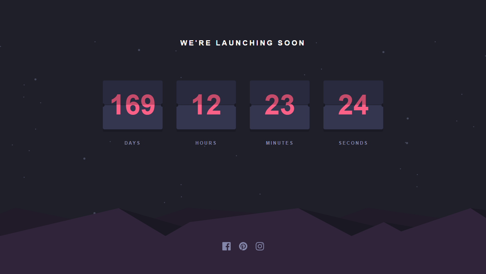

# Frontend Mentor - Launch countdown timer solution

This is a solution to the [Launch countdown timer challenge on Frontend Mentor](https://www.frontendmentor.io/challenges/launch-countdown-timer-N0XkGfyz-). Frontend Mentor challenges help you improve your coding skills by building realistic projects.

## Table of contents

- [Overview](#overview)
  - [The challenge](#the-challenge)
  - [Screenshot](#screenshot)
  - [Links](#links)
- [My process](#my-process)
  - [Built with](#built-with)
  - [What I learned](#what-i-learned)
  - [Continued development](#continued-development)
- [Author](#author)
- [Acknowledgments](#acknowledgments)

## Overview

### The challenge

Users should be able to:

- See a live countdown timer that ticks down every second (start the count at 80 days)

### Screenshot

### Design

### Links

- Live Site URL: [https://your-live-site-url.com](https://fabriciodag.github.io/FM-ReactLaunchCountdown/]([https://your-live-site-url.com](https://fabriciodag.github.io/FM-ReactLaunchCountdown/))

## My process

### Built with

- Semantic HTML5 markup
- CSS custom properties
- Flexbox
- CSS Grid
- Mobile-first workflow
- StackBlitz plataform
- [React](https://reactjs.org/) - JS library

### What I learned

During the execution of a practical project, I delved into creating a custom React hook, gained insights into JavaScript date handling, and experimented extensively with responsive design within CSS inside react components. This project not only improved my understanding of React and JavaScript but also honed my problem-solving skills and critical thinking abilities.

### Continued development

I encountered challenges while working with multilayer background images and i will incorporate animated card flips into the calendar whenever the timer countdowns.

## Author

- Website - [Fabrício D'Agostini]Soon
- Frontend Mentor - [@yourusername](https://www.frontendmentor.io/profile/yourusername)

## Acknowledgments

Matheus Batisti - Hora de Codar - (https://www.youtube.com/watch?v=uYSV4w1FFnE)
